[](https://github.com/fusion-energy/model_benchmark_zoo/actions/workflows/ci_cad_to_dagmc.yml)

[](https://github.com/fusion-energy/model_benchmark_zoo/actions/workflows/ci_cad_to_openmc.yml)

# A collection of CAD and equivalent Constructive Solid Geometry

Matching geometries in CAD format and Constructive Solid Geometry (CSG) for computational benchmarks. This provides particle transport codes an opportunity to verify particle transport with both geometry types.

This benchmark is unique and invaluable if you want to test that a particle transport code gets the same results in CSG and CAD geometry transport as it provides geometries that:
- cover all standard CSG surface types
    - planes
    - spheres
    - cylinders
    - tori
    - cones
    - general quadratics
- cover contacting and non-contacting geometries (to test imprint and merging)
- cover single and multibody geometries
- models are parametric so can easily be changed for parameter studies

I originally made this repository as there was no other comparison of CSG geometry with DAGMC geometry available and I wanted to verify the level of surface discretisation that was needed to provide accurate results.

The repository then grew into a way to test my DAGMC geometry making package [cad-to-dagmc](https://github.com/fusion-energy/cad_to_dagmc). Later on tests for [cad-to-openmc](https://github.com/openmsr/CAD_to_OpenMC) which is another geometry making package were also added.  


| Model | Description | Materials | Meshing challenge |
|---|---|---|---|
| <p align="center">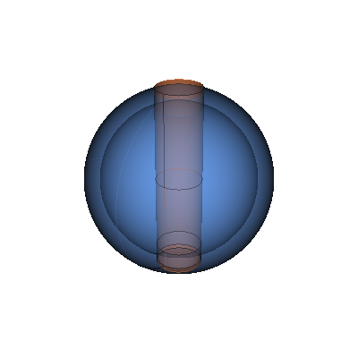</p> | Simplified tokamak | 2 | Multi-body with nested curved shells and cylindrical penetration |
| <p align="center">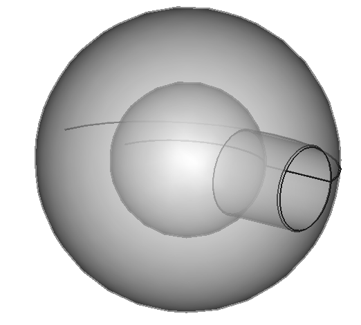</p> | Oktavian sphere | 2 | Nested spherical and cylindrical regions with complex boolean intersections |
| <p align="center">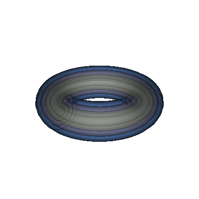</p> | Nested tori | 4 | Double curvature with concentric toroidal shells requiring imprint and merge |
| <p align="center">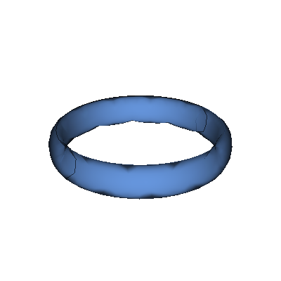</p> | Elliptical torus | 1 | Non-uniform curvature from elliptical cross-section on a toroidal path |
| <p align="center">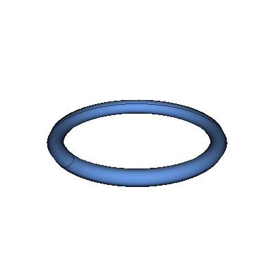</p> | Circular torus | 1 | Genus-1 topology with double curvature and saddle-point regions |
| <p align="center">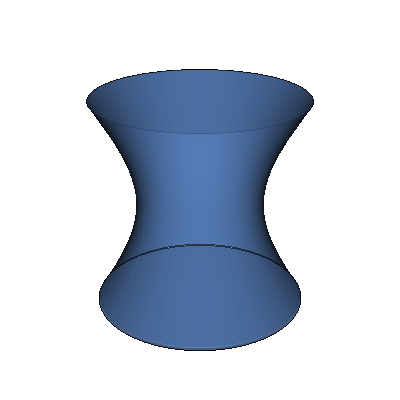</p> | Hyperboloid | 1 | Negative Gaussian curvature surface; concave and convex directions simultaneously |
| <p align="center">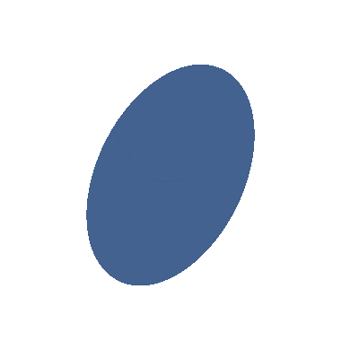</p> | Paraboloid | 1 | Curvature varying from tight at the vertex to nearly flat far from the axis |
| <p align="center">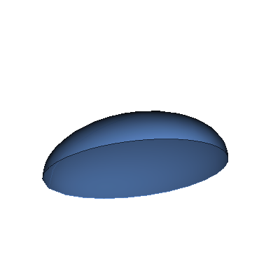</p> | Ellipsoid | 1 | Non-uniform curvature with poles where mesh elements tend to collapse |
| <p align="center">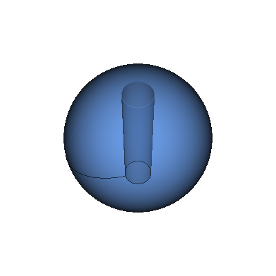</p> | Sphere with cylindrical hole | 1 | Curved-to-curved boolean intersection producing saddle-shaped seam edges |
| <p align="center"></p> | Box with spherical cavity | 1 | Flat-to-curved boolean intersection; sharp curvature transition at cavity edge |
| <p align="center">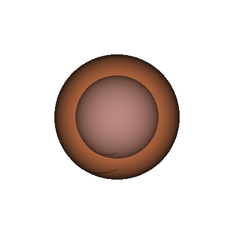</p> | Nested sphere | 2 | Concentric curved shells requiring conformal surface meshes at the shared interface |
| <p align="center">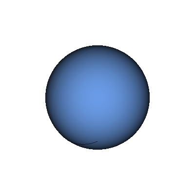</p> | Sphere | 1 | Uniform curvature with poles; baseline for faceting error on curved surfaces |
| <p align="center">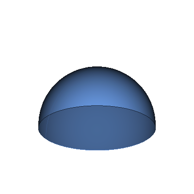</p> | Hemisphere | 1 | Curved-to-flat transition at the cut plane; sharp edge where sphere meets plane |
| <p align="center">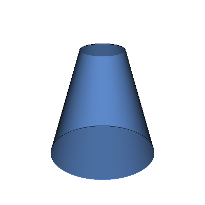</p> | Truncated cone | 1 | Linearly varying radius; mesh grading from wide base to narrow top |
| <p align="center">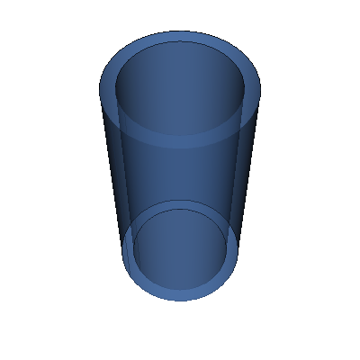</p> | Pipe | 1 | Hollow cylindrical wall; thin annular cross-section with inner void |
| <p align="center"></p> | Nested cylinders | 2 | Concentric cylindrical shells; conformal meshing at shared curved interfaces |
| <p align="center">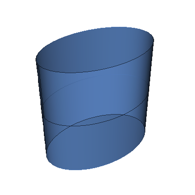</p> | Elliptic cylinder | 1 | Non-uniform curvature around the cross-section; tight curvature at minor-axis ends |
| <p align="center">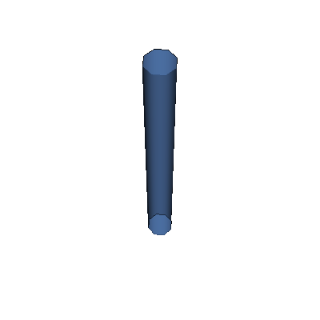</p> | Cylinder | 1 | Single curvature surface; baseline for cylindrical faceting accuracy |
| <p align="center">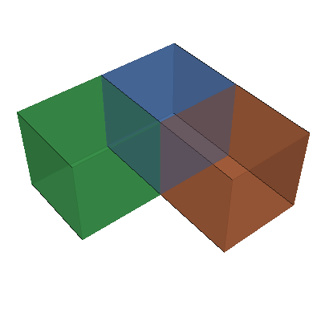</p> | Three touching cuboids | 3 | Multi-body imprinting at T-shaped shared faces; triple-edge junction |
| <p align="center"></p> | Two touching cuboids | 2 | Shared planar face imprinting between two bodies |
| <p align="center"></p> | Two tetrahedrons in contact | 2 | Shared triangular face with acute dihedral angles at all edges |
| <p align="center">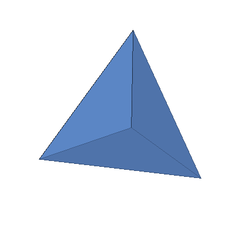</p> | Tetrahedron | 1 | Acute edges and vertices; mesh quality at sharp corners of a simplex |
| <p align="center"></p> | Cuboid | 1 | All-planar baseline; tests basic flat-face meshing and 90-degree edges |
| <p align="center">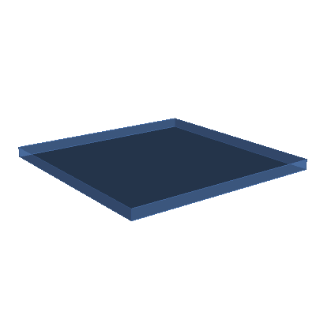</p> | Thin plate | 1 | High aspect ratio (20:1); thin-wall volume meshing with very few layers through thickness |
| <p align="center">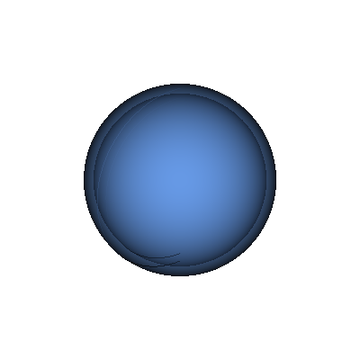</p> | Thin-walled sphere | 1 | Curved thin shell; element quality in narrow gap between two concentric curved surfaces |
| <p align="center">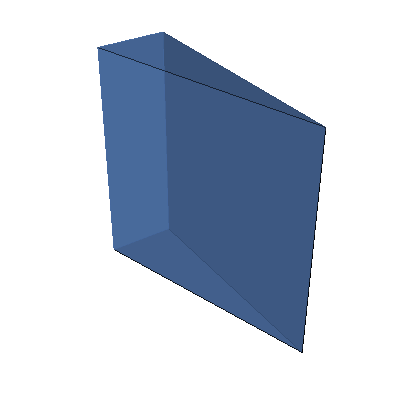</p> | Wedge | 1 | Acute dihedral angle (~17 degrees); tet quality degrades at sharp edges |
| <p align="center">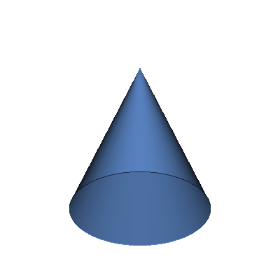</p> | Cone | 1 | Degenerate apex where surface converges to a point; element collapse at tip |
| <p align="center">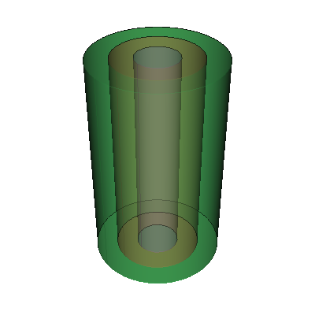</p> | Concentric cylinders | 3 | Three nested cylindrical shells; multi-region imprint and merge on curved interfaces |
| <p align="center">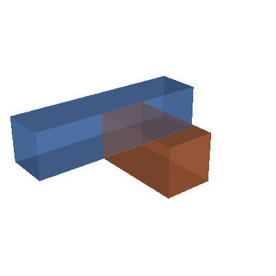</p> | T-junction | 2 | Right-angle body contact; non-coincident face imprinting at a partial shared surface |
| <p align="center">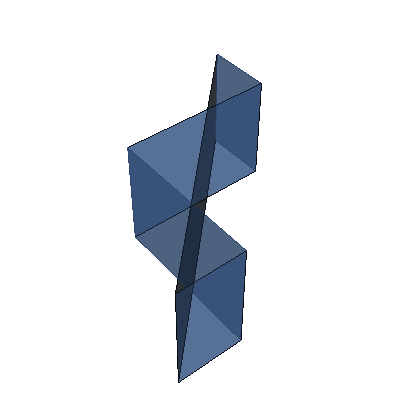</p> | L-shaped solid | 1 | Non-convex body with a sharp 90-degree re-entrant corner |


First clone the repository:

```bash
git clone https://github.com/fusion-energy/model_benchmark_zoo.git
cd model_benchmark_zoo
```

## Install using pip

```bash
python -m venv .venv
source .venv/bin/activate
pip install -r requirements.txt
pip install .
```

This uses an [extra index](https://shimwell.github.io/wheels) for pre-built OpenMC wheels.

## Install using Mamba

Requires a Conda/Mamba distribution:

- [Miniforge](https://github.com/conda-forge/miniforge#miniforge-pypy3) (recommended as it includes mamba)
- [Anaconda](https://www.anaconda.com/download)
- [Miniconda](https://docs.conda.io/en/latest/miniconda.html)

```bash
mamba env create -f environment.yml
mamba activate model_benchmark_zoo
pip install .
```

If the environment solve fails, you can try [installing OpenMC from source](https://docs.openmc.org/en/stable/quickinstall.html) instead.

## Usage

Example scripts that make CSG and DAGMC geometry can be found in [the examples folder](https://github.com/fusion-energy/model_benchmark_zoo/tree/main/examples)
