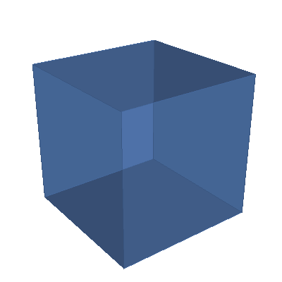
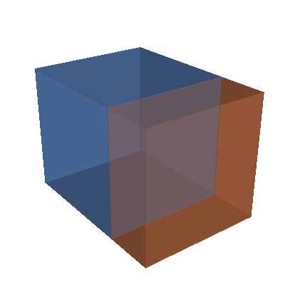
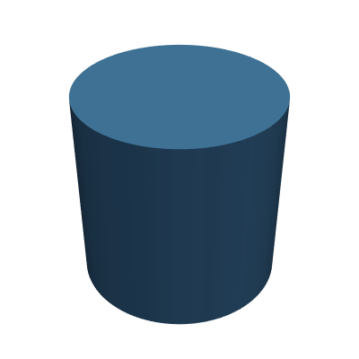
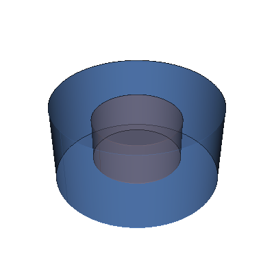
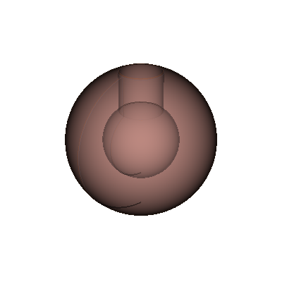
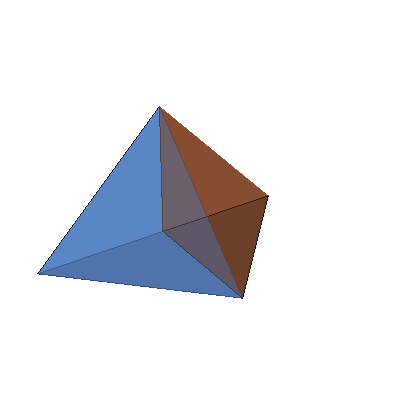
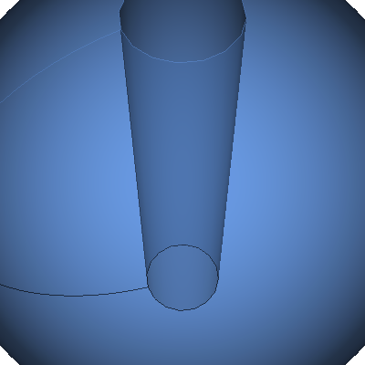

[](https://github.com/fusion-energy/model_benchmark_zoo/actions/workflows/ci_cad_to_dagmc.yml)

[](https://github.com/fusion-energy/model_benchmark_zoo/actions/workflows/ci_cad_to_openmc.yml)

# A collection of parametric CAD and equivalent Constructive Solid Geometry

Models available both in Constructive Solid Geomtry (CSG) and CAD format for comparing neutronics simulations with both geometry types.

| Model | Description |
|---|---|
| <p align="center"></p> | Cuboid |
| <p align="center"></p> | Sphere |
| <p align="center"></p> | Nested sphere |
| <p align="center"></p> | Two touching cuboids |
| <p align="center"></p> | Cylinder |
| <p align="center"></p> | Nested cylinders |
| <p align="center"></p> | Circular torus |
| <p align="center"></p> | Nested tori |
| <p align="center"></p> | Elliptical torus |
| <p align="center"></p> | Simplified tokamak |
| <p align="center"></p> | Oktavian sphere |
| <p align="center"></p> | Tetrahedron |
| <p align="center"></p> | Two tetrahedrons in contact |
| <p align="center"></p> | Sphere with cylindrical hole |
| <p align="center"></p> | Box with spherical cavity |
| <p align="center"></p> | Three touching cuboids |
| <p align="center"></p> | Hemisphere |


## Installation prerequisite

In principle, any Conda/Mamba distribution will work. A few Conda/Mamba options are:

- [Miniforge](https://github.com/conda-forge/miniforge#miniforge-pypy3) (recommended as it includes mamba)
- [Anaconda](https://www.anaconda.com/download)
- [Miniconda](https://docs.conda.io/en/latest/miniconda.html)

## Install using Mamba and pip

This example assumes you have installed the MiniForge option or separately
installed Mamba with ```conda install -c conda-forge mamba -y```

Create a new conda environment, I've chosen Python 3.10 here but newer versions should also work.

```bash
mamba create --name new_env python=3.10 -y
```

Activate the environment

```bash
mamba activate new_env
```

Install the dependencies, if this fails to solve the environment you could also try [installing OpenMC from source](https://docs.openmc.org/en/stable/quickinstall.html) which might be preferred.

```bash
mamba install -y -c conda-forge gmsh python-gmsh "openmc=dagmc*nompi*"
```

CadQuery should then be installed, here is the mamba command and the pip command.

```bash
mamba install -y -c conda-forge ocp cadquery
```

If the mamba command fails to solve the environment then try this pip command.

```bash
python -m pip install cadquery-ocp cadquery
```

Then you can install whichever convertor you want to test. The cad_to_dagmc and the CAD_to_OpenMC packages can both be installed with ```pip``` or ```conda```. **Warning** these should be installed in separate environments as they require a different version of Open Cascade.

```bash
python -m pip install cad_to_dagmc
```

or

```bash
python -m pip install CAD_to_OpenMC
```

Then you can install the model benchmark zoo with ```pip```

```bash
python -m pip install git+git://github.com/fusion-energy/model_benchmark_zoo.git
```

## Usage

Example scripts that make CSG and DAGMC geometry can be found in [the examples folder](https://github.com/fusion-energy/model_benchmark_zoo/tree/main/examples)
